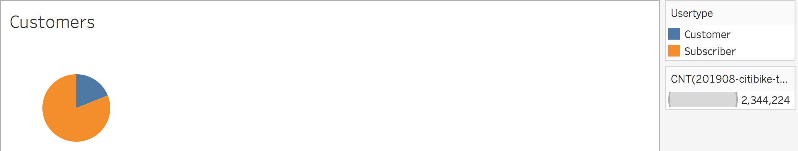
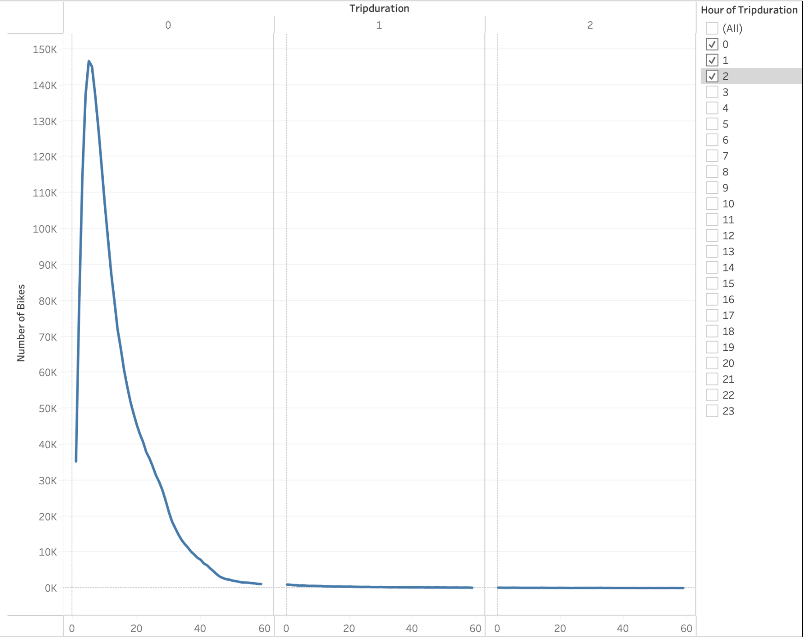
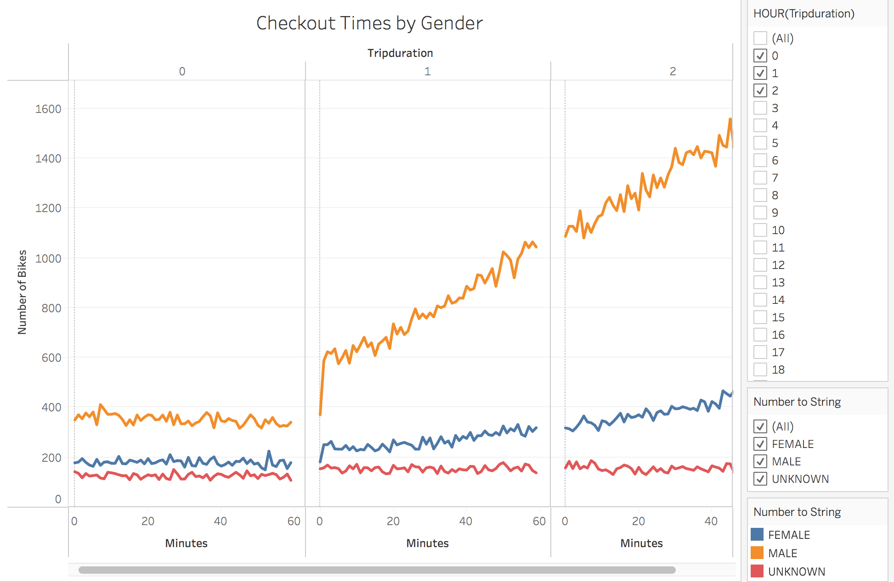
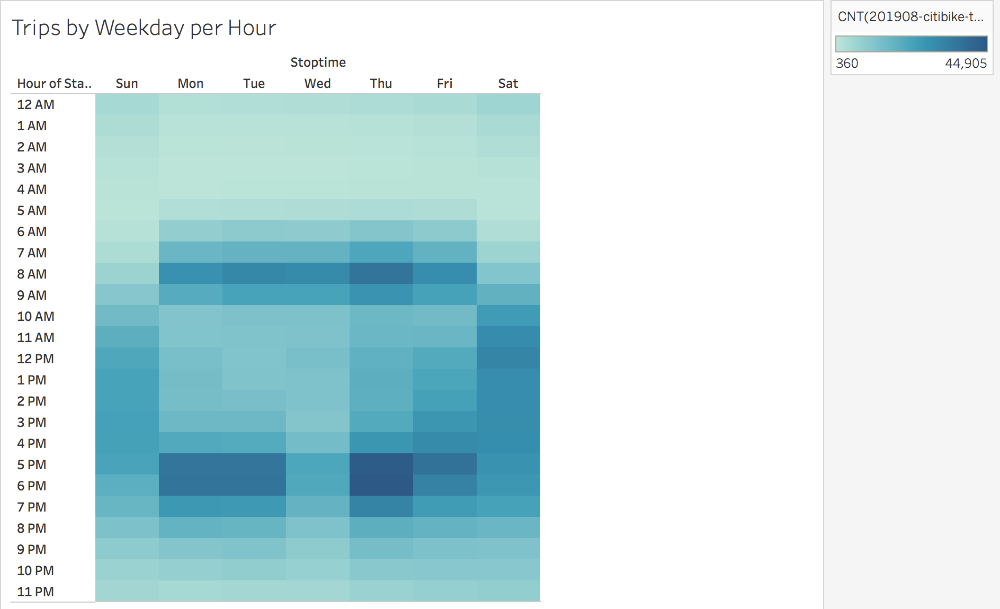
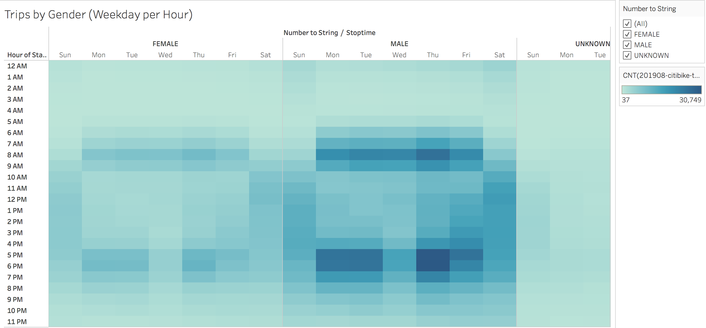
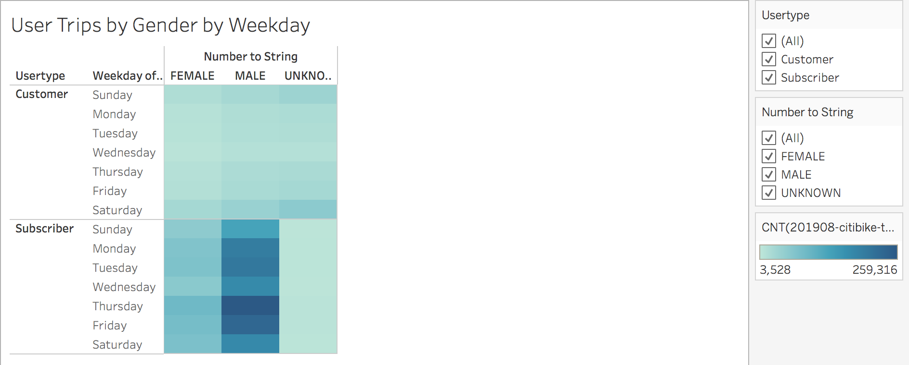
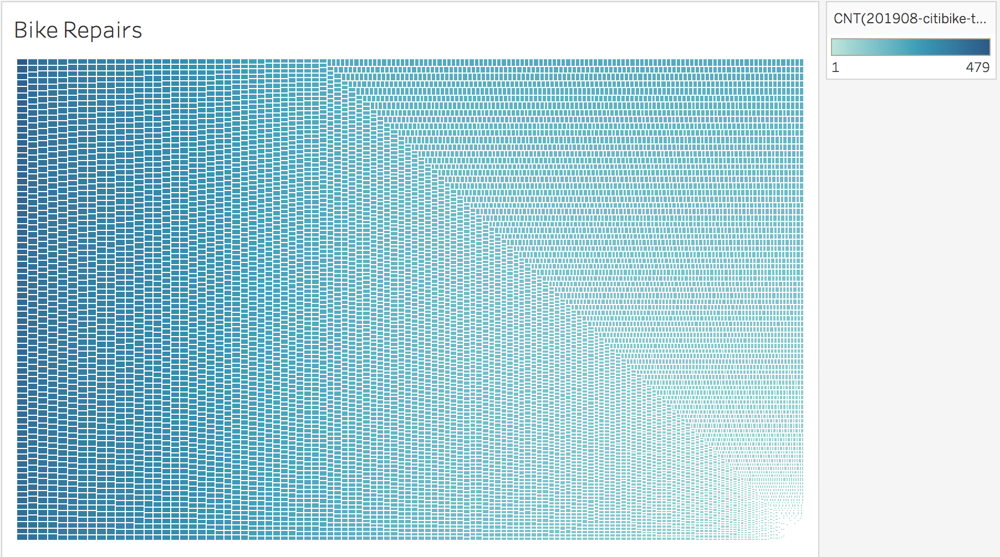

# Bikesharing

## Overview:

The purpose of this project is to see if a bike-sharing business is worth implementing in Des Moines, Iowa. Using Pandas and Tableau, we have transformed and visualized Citibike data from New York to understand how this program works and if it will be successful in the city of Des Moines.

[link to dashboard](LINK GOES HERE "Tableau Public dashboard")

## Results:

In the month of August, there was a total of 2,344,224 trips.

The pie chart above shows that out of the 2,344,224 users of Citibike in NYC in August, 81% of users are subcribers to Citibike, and 19% are regular customers.

The line chart above shows that the checkout times for users are highest at hour 0, with 5 minutes into the trip duration, with 146,752 number of bikes checked out. We see the longer the trip duration, less bikes checked out.

The line chart above breaks down the same information as the previous line chart by gender. From this visualization, we can see that the peak in hour 0 of the trip duration, 34,151 bikes were checked out by females, 108,087 bikes were checked out by males, and about 7,389 were checked out by an unknown gender.

The heat map above shows that most bikes are rented from 7-9 am and 5-7 pm on weekdays and throughout the day (around 10 am to 7 pm) on weekends. Since people are more likely to bike to and from work on weekdays or to after work activities before and after work hours, it makes sense as to why bikes would be checked out during those times. On weekends, more bikes are rented throughout the day, as less people work during those hours on weekends and most likely use it for leisure.

The heat map above shows the same information as the previous heatmap, but with the bike data broken down by gender. From the heatmap, it is clear that overall more males bike from 7-9 am and 5-7 pm on weekdays than women. Both genders also bike more on saturdays and sundays throughout the day, as most people have weekends off.

The heat map above includes bike trips by user type, gender, and weekday. From the heatmap, it is clear that subscribers bike a lot more than customers, with males subscribers biking substantially more than females. Bike usage among men stays above 100,000 bikes every day of the week, whereas the female bike rides never reach 100,000 on any weekday.

The image above identify bikes that need bike repairs based on bike ID and usage. This allows the city to keep track of how often they need to do any repairs/maintenance on bikes. As you move from right to left, bike usage increases. In other words, bikes on the far left are those that need the more immediate repairs done, due to a higher bike usage amongst customers.

## Summary
Overall, most of the bikes checked out are by subscribers, males in particular checking out bikes in the mornings to commute to and from work and throughout the day on weekends. Two additional visualizations that could help interpret the data are a bar chart showing the breakdown of rides by age and gender as well as a heatmap that breaks down the bike use by age, weekday, and time of day to better see the variation in users of Citibike.

